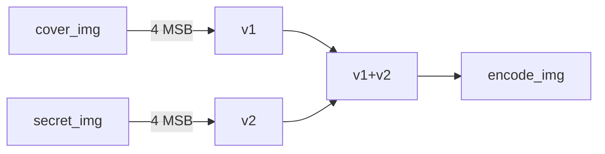
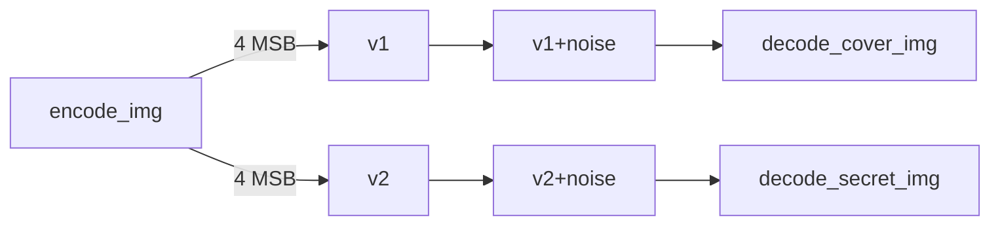

# Increasing the efficiency of the image steganography technique using the joblib.Parallel library
 
# Introduction
Steganography, from the Greek *stegano*, meaning to hide, and *graphy*, meaning writing. In other words, it is the art used to hide or conceal messages within a material. This technique has been used for thousands of years, but the difference is that today we have more advanced means of communication, as for example, during the Second World War, invisible ink was applied to artistic paintings, and today the messages are hidden inside digital images.


The main advantage of steganography is that it does not call the attention of third parties that are not part of the communication, for example, a sender applies the technique and sends it to the receiver, the receiver knows how to extract the information, while a third party cannot identify it because he does not know of the existence of this information.

Today the technique of steganography is applied to different digital file formats, such as images, audio, video and text files. The main use of steganography is among criminal organizations and people seeking to communicate illicit acts. This is why steganography does not attract the attention of digital forensics authorities, which is a specialized field of digital forensics.

The main objective of this work is to apply the steganography technique to a *dataset* of images, along with an algorithm parallelization technique in order to reduce execution time.
 


Figure 1 - Applying steganography to Lena's image
 

Figure 1.1 - Secret Image of Figure 1


Figure 1.2 - [Hidden Image - Hidden Image Revealed - Secret Image Revealed]
 
# Development
Based on the concepts of concealment and extraction of information in digital images, it was possible to apply the steganography technique to a *dataset* of one thousand images. Of the existing methods in steganography, there are transform algorithms such as *Discrete Cosine Transform (DCT)* and *Discrete Fourier Transform (DFT)*.
For this work, I'll use the *Largest Significant Bit (LSB) method*, because it is not the focus of this work to use a more advanced method, the LSB is easier to develop the algorithm, being simpler and more understandable. 
 
 

Figure 2 - Least significant bit
 
The algorithm for hiding and extracting one image from another can be seen in the diagram below.
 
 


**Encoding: Hiding one image within another**

**Decoding: Extracting the image**

Reading a **pixel** from an image, from a computational point of view, can be seen as follows:
```
for  i  in  range(w):
    for  j  in  range(h):
        for  k  in  range(3):
```

Where the iterations of the loops correspond to **width**, **height** and **RGB channels** respectively.
Each pixel is composed of three vectors of eight positions. R[8], G[8] and B[8].
 
#### The definition of height and width, can be defined as follows:
```
w = secret_image.shape[0]
h = secret_image.shape[1]
```


Where **secret_image** is the image we want to hide inside another regular image
 
#### To read this image, the computer vision library *OpenCV* was used


```
import cv2 as cv
secret_image = cv.imread('config/secret_image.bmp')
```
 
## Working in Batches
Finding hidden information in images is extremely slow when done manually. To work with large amounts of data, it was necessary to divide the algorithm into two parts: an algorithm that encodes images and another that decodes these images.


### Encode Algorithm
 
#### Creating an image list using listdir
Reading the image dataset *raw*.
```
path = path.dirname(path.realpath(__file__)) + "\dataset"
files = [f  for  f  in  listdir(path)]
```
#### Applying the hiding technique: Encode
```
for  file  in  files:i
    img = cv.imread(f'dataset/{file}')
    imagem_codificada = codifica(img)
    cv.imwrite(f"sequential_encoded/{file}", imagem_codificada)
```
We created a function *encode( )* that receives the image *raw* (without encoding).
The function does all the encoding, returning the image ready to be written to the directory.
 
#### Function codifica( )
```
def codifica(cover_image):
    encode_image = cover_image
    secret_image = cv.imread('config/secret_image.bmp')
    w = secret_image.shape[0]
    h = secret_image.shape[1]
 
    for i in range(w):
        for j in range(h):
            for k in range(3):
                v1 = format(encode_image[i][j][k], '08b')
                v2 = format(secret_image[i][j][k], '08b')
                v3 = v1[:5] + v2[:3]
                encode_image[i][j][k] = int(v3,2)
    return encode_image
```
### Decode Algorithm
#### Preparing the image list
Reading the shorthand images.
```
path = path.dirname(path.realpath(__file__)) + "\dataset_encoded"
files = [f for f in listdir(path)]
```
#### Applying the extraction technique: Decode
```
for file in files:
    img = cv.imread(f'dataset_encoded/{file}')
    secret_image = decodifica(img)
    cv.imwrite(f"dataset_decoded/{file}", secret_image)
```
 
A function *decode( )* was created, which receives the encoded image and passes it to the decode function, which returns the revelation of the secret image that is hidden, saving it in the directory.
 
#### Function decode( )
```
def decodifica(img):
    new_img = img[:]
    w = img.shape[0]
    h = img.shape[1]
    img1 = np.zeros((w, h, 3), np.uint8)
    secret_image = np.zeros((w, h, 3), np.uint8)
   
    for i in range(w):
        for j in range(h):
            for k in range(3):
                v1 = format(new_img[i][j][k], '08b')
                v2 = v1[:3] + chr(random.randint(0, 1) + 48) * 3
                v3 = v1[5:] + chr(random.randint(0, 1) + 48) * 5
                img1[i][j][k] = int(v2, 2)
                secret_image[i][j][k] = int(v3, 2)
    return secret_image
```
 
## Observed problem
Working with large amount of data requires high computational processing power. To get a better gain of time and increasing the efficiency of the algorithm, performance analysis tools like *CProfile*, *gprof2dot* and *PyInstrument* were used. the algorithm that encodes images, i.e. hides a secret image (secret_image) in a common image (cover_image) and was also applied to the algorithm that decodes shorthand images (extracts the secret_image from the cover_image).
 
### Performance Profile
#### cProfile
```
python3 -m cProfile -o profile/cprofileEncode.out sequential_steganography_encode.py
python3 -m cProfile -o profile/cprofileDecode.out sequential_steganography_decode.py
```
 
#### gprof2dot
```
gprof2dot -f pstats profile/cprofileEncode.out | dot -Tpng -o img/CProfile_encode.png
gprof2dot -f pstats profile/cprofileEncode.out | dot -Tpng -o img/CProfile_decode.png
```
 
####  PyInstrument
```
pyinstrument sequential_steganography_encode.py
pyinstrument sequential_steganography_decode.py
```
### Performance Analysis Results
 
#### Encoding Algorithm
##### Using CProfile

##### Usando gprof2dot

##### Usando PyInstrument

 
#### Decoding Algorithm
##### Using CProfile

##### Using gprof2dot

 
With the results of the performance profiling run, it is possible to identify that the decoding method needs more attention for better performance, especially in the function that consumes the most processing and time, function *decodes ( )*.
 
## Proposed problem solving
After collecting the data and identifying the problem, the need arises to increase the efficiency of the algorithm. It was
chosen the parallelism library *joblib*.

### JobLib
Joblib is a library that provides tools for simple and easy *Python* parallelization. It is optimized to be fast for large amounts of data and has optimizations for *numpy* arrays.
 
#### Install joblib
```
pip install joblib
```
#### Import to library
```
from joblib import Parallel, delayed
```
You need to import two modules from the library, the *Parallel* and the *delayed* module.
 
The syntax of using the joblib library can be seen as follows:
```
Parallel(_n_jobs=None_, _backend=None_, _verbose=0_, _timeout=None_, _pre_dispatch='2  *  n_jobs'_, _batch_size='auto'_, _temp_folder=None_, _max_nbytes='1M'_, _mmap_mode='r'_, _prefer=None_, _require=None_)
```
A reduced version applicable to the problem.
```
Paralell(n_jobs = 1)(delayed(funçãoDeInteresse)(parâmetro) for file in files)
```
#### Understanding n_jobs
If Parallel's native parameter n_jobs is -1, all CPUs will be used. If it is 1, no parallelization will take place and the code will follow
 
 
### Parallelizing the process of decoding steganographic images
The parallelization was implemented in the function call responsible for decoding the images.
 
```
Parallel(n_jobs = 8, backend=multiprocessing, batch_size=8)(delayed(decodifica)(file) for  file  in  files)
```
You can see that the *decode ( )* function call is passed as an argument to the *delayed* decorator, where this decorator receives the decode ( ) function and its arguments.
 
 
# Conclusion
Analyzing the results, as shown in the images below, it is possible to identify a gain of more than 200% in a parallel version, in the best case scenario of CPU usage.
 

 

 
 
 
 
# Reference
 
https://www.gta.ufrj.br/grad/09_1/versao-final/stegano/introducao

html#:~:text=O%20termo%20esteganografia%20deriva%20do,escondem%20dados%20dentro%20de%20arquivos

http://www.ic.uff.br/~celio/papers/minicurso-sbseg07.pdf

https://www.gta.ufrj.br/ensino/eel878/redes1-2016-1/16_1/esteganografia/#:~:text=deve%20ser%20bloqueada.-,Hist%C3%B3rico,hoje%20seriam%20enquadradas%20nessa%20%C3%A1rea

http://ric.cps.sp.gov.br/bitstream/123456789/5429/1/Gesta%CC%83o%20da%20tecnologia%20da%20informac%CC%A7a%CC%83o_2021_1_RichardMartinsBastos_Pericia%20forense%20%E2%80%93%20A%20utilizac%CC%A7a%CC%83o%20da%20esteganografia%20em%20mi%CC%81dias%20digitais%20no%20crime%20organizado%20.pdf

https://imasters.com.br/arquitetura-da-informacao/esteganografia-a-arte-de-esconder-parte-01

http://multimedia.ufp.pt/codecs/compressao-com-perdas/metodos-baseados-em-transformadas/
transformada-discreta-do-coseno-dct/

https://www.kaspersky.com.br/blog/digital-steganography/12132/

https://pypi.org/project/gprof/

https://pypi.org/project/CProfileV/

https://joblib.readthedocs.io/en/latest/installing.html
