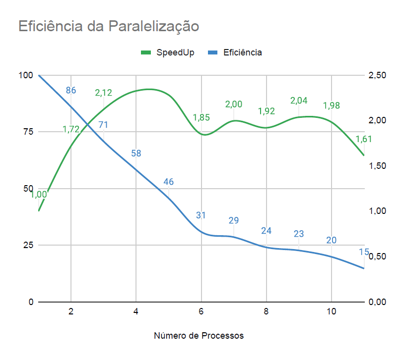

# Aumento da eficiência da técnica de esteganografia em imagens a partir do uso da biblioteca joblib.Parallel
 
# Introdução
Esteganografia, do grego *estegano*, que significa esconder, e *grafia*, que significa escrita. Ou seja, é a arte utilizada para esconder ou ocultar mensagens dentro de um material. Há milhares de anos que essa técnica vem sendo usada, a diferença da aplicação para a atualidade, é que hoje temos meios de comunicação mais avançados, como por exemplo na Segunda Guerra Mundial, era aplicado tinta invisível em quadros artísticos, e nos dias de hoje as mensagens estão escondidas dentro de imagens digitais.

A principal vantagem da esteganografia é que ela não chama a atenção de terceiros que não fazem parte da comunicação, por exemplo, um emissor aplica a técnica e faz o envio para o receptor, o receptor sabe como extrair a informação, já um terceiro não consegue identificar pois ele não sabe da existência dessa informação.

Atualmente a técnica de esteganografia é aplicada em diferentes formatos de arquivos digitais, como por exemplo em imagens, áudio, vídeo e arquivos de textos. O principal uso da esteganografia está entre as organizações criminosas e por pessoas que buscam comunicação de atos ilícitos. Motivo que a esteganografia não chama a atenção de autoridades de perícia forense digital, que é área especializada em perícia digital.

O principal objetivo deste trabalho é a aplicação da técnica de esteganografia em um *dataset* de imagens, juntamente com técnica de paralelização de algoritmos com o objetivo de reduzir o tempo de execução.
 
 

Figura 1 - Aplicação de esteganografia na imagem da Lena
 
 


Figura 1.1 - Imagem secreta da figura 1
 

Figura 1.2 - [Imagem Oculta - Imagem Ocula Revelada - Imagem Secreta Revelada]
 
# Desenvolvimento
A partir dos conceitos de ocultação e extração de informações em imagens digitais, foi possível realizar a aplicação da técnica de esteganografia em um *dataset* de mil imagens. Dos métodos existentes em esteganografia, há algoritmos de transformadas como *Transformada Discreta de Cossenos (DCT)* e *Transformada de Fourier Discreta (DFT)*.
Para esse trabalho, utilizarei o método *Bit Mais Significativo (LSB)*, por não ser o foco do trabalho o uso de um método mais avançado, o LSB é apresenta maior facilidade para o desenvolvimento do algoritmo, por ser mais simples e compreensível.
 


Figura 2 - Bit menos significativo
 
O algoritmo de ocultação e extração de uma imagem em outra imagem, pode ser visto conforme o diagrama abaixo.
 
**Encode: Ocultando uma imagem em outra**

**Decode: Extraindo a imagem**

A leitura de um **pixel** de uma imagem, no ponto de vista computacional, pode ser visto da seguinte forma:
```
for  i  in  range(w):
    for  j  in  range(h):
        for  k  in  range(3):
```
Onde as iterações dos laços correspondem, respectivamente, a **largura**, **altura** e **canais RGB**.
Cada pixel é composto por três vetores de oito posições. R[8], G[8] e B[8].
 
#### A definição de altura e largura, podem ser definidas da seguinte forma:
```
w = secret_image.shape[0]
h = secret_image.shape[1]
```
Onde **secret_image** é a imagem que queremos esconder dentro de uma outra imagem comum
 
#### Para a leitura desta imagem, foi utilizado a biblioteca de visão computacional *OpenCV*
```
import cv2 as cv
secret_image = cv.imread('config/secret_image.bmp')
```
 
## Trabalhando em Lotes
Encontrar informações ocultas em imagens é algo extremamente lento quando feito de forma manual. Para trabalhar em grande quantidade de dados, foi necessário dividir o algoritmo em duas partes: Um algoritmo que codifica imagens e outro que decodifica essas imagens.
 
### Algoritmo Encode
 
#### Criando uma lista de imagens usando listdir
Leitura do dataset de imagens *raw*.
```
path = path.dirname(path.realpath(__file__)) + "\dataset"
files = [f  for  f  in  listdir(path)]
```
#### Aplicando a técnica de ocultação: Encode
```
for  file  in  files:i
    img = cv.imread(f'dataset/{file}')
    imagem_codificada = codifica(img)
    cv.imwrite(f"sequential_encoded/{file}", imagem_codificada)
```
Foi criado uma função *codifica( )* que recebe a imagem *raw* (sem codificação).
A função faz todo o processo de codificação, retornando a imagem pronta pra ser gravada no diretório.
 
#### Função codifica( )
```
def codifica(cover_image):
    encode_image = cover_image
    secret_image = cv.imread('config/secret_image.bmp')
    w = secret_image.shape[0]
    h = secret_image.shape[1]
 
    for i in range(w):
        for j in range(h):
            for k in range(3):
                v1 = format(encode_image[i][j][k], '08b')
                v2 = format(secret_image[i][j][k], '08b')
                v3 = v1[:5] + v2[:3]
                encode_image[i][j][k] = int(v3,2)
    return encode_image
```
### Algoritmo Decode
#### Preparando a lista de imagens
Lendo as imagens estenográficas.
```
path = path.dirname(path.realpath(__file__)) + "\dataset_encoded"
files = [f for f in listdir(path)]
```
#### Aplicando a técnica de extração: Decode
```
for file in files:
    img = cv.imread(f'dataset_encoded/{file}')
    secret_image = decodifica(img)
    cv.imwrite(f"dataset_decoded/{file}", secret_image)
```
 
Foi criado uma função *decodifica( )* que recebe a imagem codificada e passa pra função decodifica, que retorna a revelação da imagem secreta que está ocultada, gravando no diretório.
 
#### Função decodifica( )
```
def decodifica(img):
    new_img = img[:]
    w = img.shape[0]
    h = img.shape[1]
    img1 = np.zeros((w, h, 3), np.uint8)
    secret_image = np.zeros((w, h, 3), np.uint8)
   
    for i in range(w):
        for j in range(h):
            for k in range(3):
                v1 = format(new_img[i][j][k], '08b')
                v2 = v1[:3] + chr(random.randint(0, 1) + 48) * 3
                v3 = v1[5:] + chr(random.randint(0, 1) + 48) * 5
                img1[i][j][k] = int(v2, 2)
                secret_image[i][j][k] = int(v3, 2)
    return secret_image
```
 
## Problema observado
Trabalhar com grande quantidade de dados requer um poder de processamento computacional elevado. Para obter um melhor ganho de tempo e aumentando a eficiência do algoritmo, foi utilizado ferramentas de análise de desempenho como *CProfile*, *gprof2dot* e *PyInstrument*.  ara o algoritmo que codifica imagens, ou seja, oculta uma imagem secreta (secret_image) em uma imagem comum (cover_image) e também foi aplicado no algoritmo que decodifica imagens estenográficas (extrai a secret_image da cover_image).
 
### Perfil de Desempenho
#### cProfile
```
python3 -m cProfile -o profile/cprofileEncode.out sequential_steganography_encode.py
python3 -m cProfile -o profile/cprofileDecode.out sequential_steganography_decode.py
```
 
#### gprof2dot
```
gprof2dot -f pstats profile/cprofileEncode.out | dot -Tpng -o img/CProfile_encode.png
gprof2dot -f pstats profile/cprofileEncode.out | dot -Tpng -o img/CProfile_decode.png
```
 
####  PyInstrument
```
pyinstrument sequential_steganography_encode.py
pyinstrument sequential_steganography_decode.py
```
### Resultados da Análise de Desempenho
 
#### Algoritmo de codificação
##### Usando CProfile

##### Usando gprof2dot

##### Usando PyInstrument

 
#### Algoritmo de decodificação
##### Usando CProfile

##### Usando gprof2dot

 
Com os resultados da execução de perfil de desempenho, é possível identificar que o método de decodificação necessita de maior atenção para uma melhor performance, principalmente na função que consome maior processamento e tempo, função *decodifica (  )*.
 
## Proposta de resolução do problema
Após a coleta dos dados e a identificação do problema, surge a necessidade de aumentar a eficiência do algoritmo. Foi
escolhida a biblioteca de paralelismo *joblib*.
 
### JobLib
Joblib é uma biblioteca que fornece ferramentas para paralelização em *Python* de forma simples e fácil. Ela é otimizada para ser rápida para uma grande quantidade de dados, possuindo otimizações para matrizes *numpy*.
 
#### Instalando joblib
```
pip install joblib
```
#### Importando a biblioteca
```
from joblib import Parallel, delayed
```
É necessário o import de dois módulos da biblioteca, o *Parallel* e o módulo *delayed*.
 
A sintaxe do uso da biblioteca joblib pode ser vista da seguinte forma:
```
Parallel(_n_jobs=None_, _backend=None_, _verbose=0_, _timeout=None_, _pre_dispatch='2  *  n_jobs'_, _batch_size='auto'_, _temp_folder=None_, _max_nbytes='1M'_, _mmap_mode='r'_, _prefer=None_, _require=None_)
```
Uma versão reduzida e aplicável ao problema.
```
Paralell(n_jobs = 1)(delayed(funçãoDeInteresse)(parâmetro) for file in files)
```
#### Entendendo n_jobs
Se o parâmetro nativo de Parallel, n_jobs for igual a -1, todas as CPUs serão utilizadas. Se ele for 1, nenhuma paralelização acontecerá e o código seguirá
 
 
### Paralelizando o processo de decodificação de imagens esteganográficas
A paralelização foi implementada na chamada da função responsável por decodificar as imagens.
 
```
Parallel(n_jobs = 8, backend=multiprocessing, batch_size=8)(delayed(decodifica)(file) for  file  in  files)
```
É possível observar que a chamada da função *decodifica ( )* é passada como argumento para o decorador *delayed*, onde este decorador recebe a função decodifica ( ) e seus argumentos.
 
 
# Conclusão
Analisando os resultados, conforme as imagens abaixo, é possível identificar um ganho mais de 200% em uma versão paralela, no melhor cenário do uso de CPUs.
 

 

 
 
 
 
# Referências
 
https://www.gta.ufrj.br/grad/09_1/versao-final/stegano/introducao

html#:~:text=O%20termo%20esteganografia%20deriva%20do,escondem%20dados%20dentro%20de%20arquivos

http://www.ic.uff.br/~celio/papers/minicurso-sbseg07.pdf

https://www.gta.ufrj.br/ensino/eel878/redes1-2016-1/16_1/esteganografia/#:~:text=deve%20ser%20bloqueada.-,Hist%C3%B3rico,hoje%20seriam%20enquadradas%20nessa%20%C3%A1rea

http://ric.cps.sp.gov.br/bitstream/123456789/5429/1/Gesta%CC%83o%20da%20tecnologia%20da%20informac%CC%A7a%CC%83o_2021_1_RichardMartinsBastos_Pericia%20forense%20%E2%80%93%20A%20utilizac%CC%A7a%CC%83o%20da%20esteganografia%20em%20mi%CC%81dias%20digitais%20no%20crime%20organizado%20.pdf

https://imasters.com.br/arquitetura-da-informacao/esteganografia-a-arte-de-esconder-parte-01

http://multimedia.ufp.pt/codecs/compressao-com-perdas/metodos-baseados-em-transformadas/
transformada-discreta-do-coseno-dct/

https://www.kaspersky.com.br/blog/digital-steganography/12132/

https://pypi.org/project/gprof/

https://pypi.org/project/CProfileV/

https://joblib.readthedocs.io/en/latest/installing.html